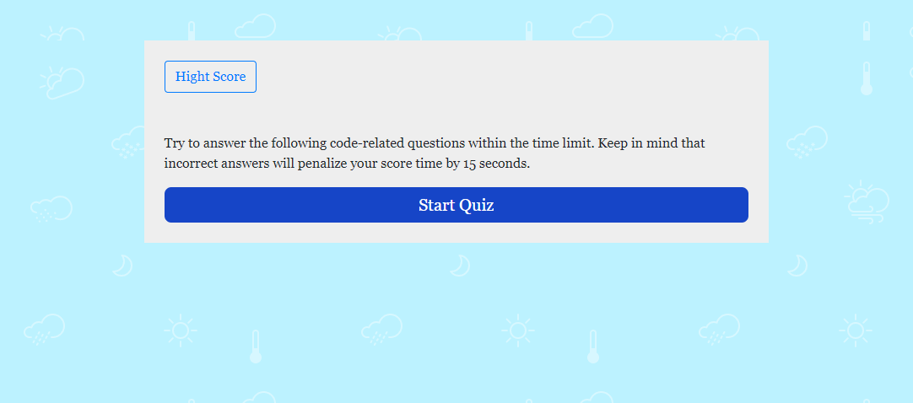

# Code-Quiz

Please visit the deployed project at: https://giselesoubeiga.github.io/Code-Quiz/

<h1>Description</h1>

The purpose of this assignment was to create a timer-based coding assessment using vanilla JavaScript that behaves like so:

The application has a few multiple choice questions and the ability to store top scores on the user's device. The number of questions decides the length of time for the quiz (15 seconds/question) once the user clicks "Start", but they are penalized 10 seconds if they answer a question incorrectly. The final score is based on the amount remaining on the timer.

At the end of the quiz (when the user answers all questions or time is up), upon viewing their score, the user is able to enter their initials to add their score to the High Scores list. Once they enter their initials, the scoreboard will appear with an option to clear the board or restart the quiz.

